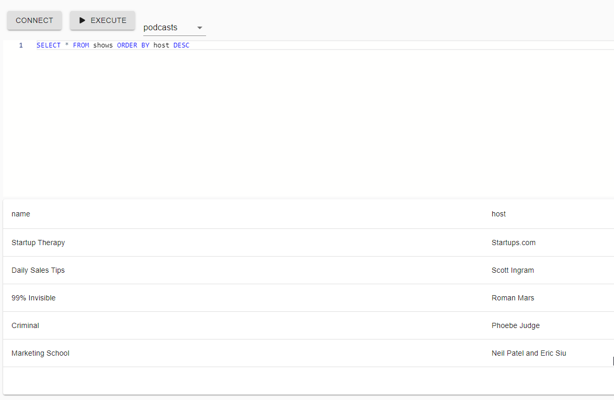

# PowerShell Universal

PowerShell Universal is the ultimate platform for building web-based IT tools. 

# Features

- [APIs](https://docs.ironmansoftware.com/api/about) - Build custom APIs with PowerShell
- [Automation](https://docs.ironmansoftware.com/automation/about) - Execute, audit and schedule PowerShell scripts
- [Dashboard](https://docs.ironmansoftware.com/dashboard/about) - Build webpages with PowerShell

# Resources

- [Downloads](https://ironmansoftware.com/downloads)
- [Documentation](https://docs.ironmansoftware.com/)
- [Pricing](https://store.ironmansoftware.com/pricing/powershell-universal)
- [Forums](https://forums.universaldashboard.io/)

# About this repository

This repository contains purpose built Components for the Universal Dashboard v3. 

# Component Libraries 

## Active Directory 

Universal Dashboard components for Active Directory.

```
Install-Module UniversalDashboard.ActiveDirectory
```

### New-UDADPasswordResetForm

Creates a form to reset Active Directory passwords. 

### New-UDADRestoreDeletedUserTable

Creates a table that allows you to restore deleted objects.

## Monitoring

Universal Dashboard monitoring components.

```
Install-Module UniversalDashboard.Monitoring
```

### New-UDPerformanceCounterGraph

Creates a graph based on the specified performance counter. 

## Network

Universal Dashboard network components. 

```
Install-Module UniversalDashboard.Network
```

### New-UDPingForm

Creates a form that allows you to ping a machine or address.

## SQL 

Universal Dashboard SQL components. Requires [dbatools](https://dbatools.io/).

```
Install-Module UniversalDashboard.SQL
```

### New-UDSQLTable

Easily create a table that performs server-side querying. 

### New-UDSQLQueryTool

Create a query tool that allows users to query a SQL database. 



## [Windows](./Components/Windows/README.md)

Universal Dashboard components for Windows. 

```
Install-Module UniversalDashboard.SQL
```

- New-UDProcessTable
- New-UDServiceTable

